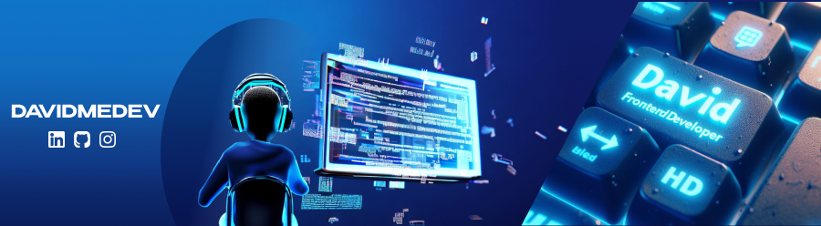

Web developer and mentor with 2 years of experience, specialized in Frontend with a solid focus on creating modern and functional user interfaces using best practices and industry standards.

I participated in multiple collaborative teams formed by Startup No Country Argentina. These experiences allowed me to develop effective communication and collaboration skills, as well as adaptability to work in dynamic environments.

As a professional, I am constantly updating my knowledge to keep up with the latest trends and technologies.

I am currently looking for a job as a Frontend Developer or similar positions.

